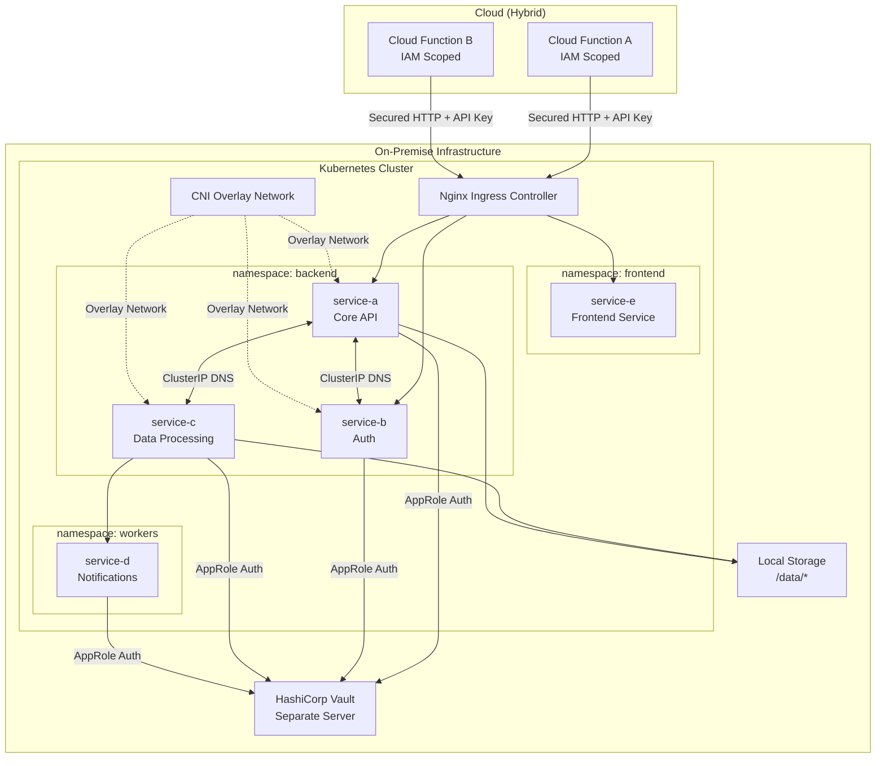
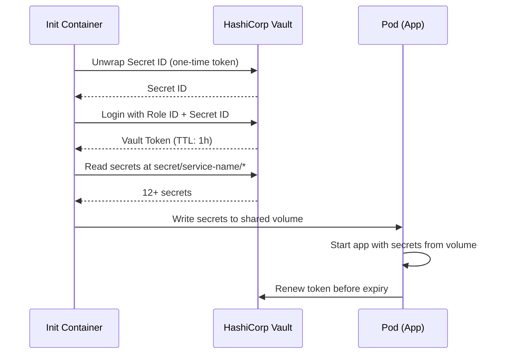
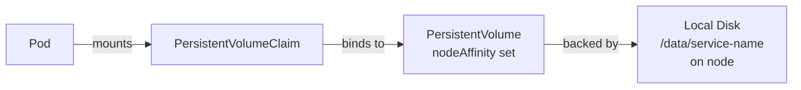
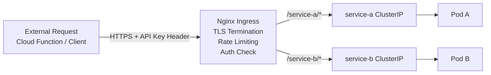

# Architecture Diagrams

## System Architecture

```mermaid
graph TB
    subgraph Cloud["Cloud (Hybrid)"]
        FA[Cloud Function A<br/>IAM Scoped]
        FB[Cloud Function B<br/>IAM Scoped]
    end

    subgraph OnPrem["On-Premise Infrastructure"]
        subgraph K8S["Kubernetes Cluster"]
            NI[Nginx Ingress Controller]

            subgraph NS_FE["namespace: frontend"]
                SVC_FE[service-e<br/>Frontend Service]
            end

            subgraph NS_BE["namespace: backend"]
                SVC_A[service-a<br/>Core API]
                SVC_B[service-b<br/>Auth]
                SVC_C[service-c<br/>Data Processing]
            end

            subgraph NS_WK["namespace: workers"]
                SVC_D[service-d<br/>Notifications]
            end

            CNI[CNI Overlay Network]
        end

        VAULT[HashiCorp Vault<br/>Separate Server]
        STORAGE[Local Storage<br/>/data/*]
    end

    FA -->|Secured HTTP + API Key| NI
    FB -->|Secured HTTP + API Key| NI
    NI --> SVC_A
    NI --> SVC_B
    NI --> SVC_FE
    SVC_A <-->|ClusterIP DNS| SVC_B
    SVC_A <-->|ClusterIP DNS| SVC_C
    SVC_C --> SVC_D
    CNI -.->|Overlay Network| SVC_A
    CNI -.->|Overlay Network| SVC_B
    CNI -.->|Overlay Network| SVC_C
    SVC_A -->|AppRole Auth| VAULT
    SVC_B -->|AppRole Auth| VAULT
    SVC_C -->|AppRole Auth| VAULT
    SVC_D -->|AppRole Auth| VAULT
    SVC_C --> STORAGE
    SVC_A --> STORAGE
```

---

## Secrets Flow (Vault AppRole)

```mermaid
sequenceDiagram
    participant IC as Init Container
    participant V as HashiCorp Vault
    participant P as Pod (App)

    IC->>V: Unwrap Secret ID (one-time token)
    V-->>IC: Secret ID
    IC->>V: Login with Role ID + Secret ID
    V-->>IC: Vault Token (TTL: 1h)
    IC->>V: Read secrets at secret/service-name/*
    V-->>IC: 12+ secrets
    IC->>P: Write secrets to shared volume
    P->>P: Start app with secrets from volume
    P->>V: Renew token before expiry
```

---

## Storage Architecture

```mermaid
graph LR
    POD[Pod] -->|mounts| PVC[PersistentVolumeClaim]
    PVC -->|binds to| PV[PersistentVolume<br/>nodeAffinity set]
    PV -->|backed by| LS[Local Disk<br/>/data/service-name<br/>on node]
```

---

## Network Flow (Nginx Ingress)

```mermaid
graph LR
    EXT[External Request<br/>Cloud Function / Client]
    EXT -->|HTTPS + API Key Header| NI[Nginx Ingress<br/>TLS Termination<br/>Rate Limiting<br/>Auth Check]
    NI -->|/service-a/*| SA[service-a ClusterIP]
    NI -->|/service-b/*| SB[service-b ClusterIP]
    SA --> PA[Pod A]
    SB --> PB[Pod B]
```
